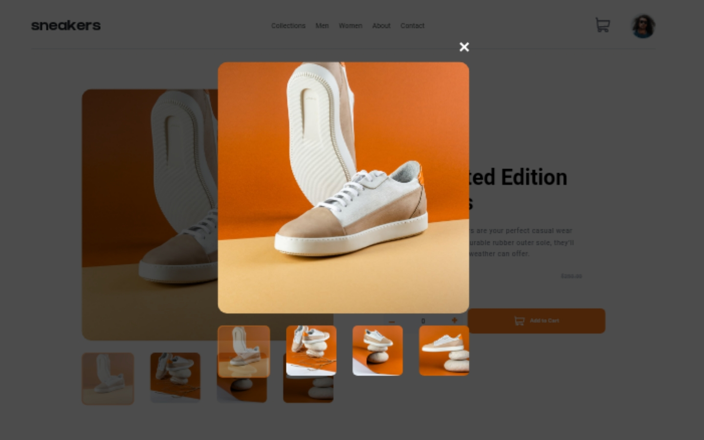

# Frontend Mentor - E-commerce product page solution

This is a solution to the [E-commerce product page challenge on Frontend Mentor](https://www.frontendmentor.io/challenges/ecommerce-product-page-UPsZ9MJp6). Frontend Mentor challenges help you improve your coding skills by building realistic projects.

## Table of contents

- [Overview](#overview)
  - [Screenshot](#screenshot)
  - [Links](#links)
  - [Built with](#built-with)
  - [What I learned](#what-i-learned)
  - [Continued development](#continued-development)
  - [Useful resources](#useful-resources)
- [Author](#author)
- [Acknowledgments](#acknowledgments)

**Note: Delete this note and update the table of contents based on what sections you keep.**

## Overview

### The challenge

Users should be able to:

- View the optimal layout for the site depending on their device's screen size
- See hover states for all interactive elements on the page
- Open a lightbox gallery by clicking on the large product image
- Switch the large product image by clicking on the small thumbnail images
- Add items to the cart
- View the cart and remove items from it

### Screenshot

	This is the screenshot of the desktop view of size 1400px by 900px showing the active light box section which you can remove by clicking the close button on top of the image to see the main section

### Links

- Solution URL: https://github.com/Silasico/e-commerce-product-page
- Live Site URL: https://silasico.github.io/e-commerce-product-page/

### Built with

- Semantic HTML5 markup
- CSS custom properties
- Flexbox
- CSS Grid
- Mobile-first workflow
- [Styled Components](https://styled-components.com/) - For styles

### What I learned

This project taught me a lot both in using HTML, CSS and JavaScript. I was able to use a lot of flexbox and css grid component in this same project as well as using javascript DOM manipulation to change the elements in the Markup. I also learnt that we can use multiple media queries in order to make my design responsive and without using bootstrap. I also learnt how to use the positions in CSS and the z-index components well especially coupled with displaing the cart box and removing it so the elements can be clickable.

To see how you can add code snippets, see below:

If you want more help with writing markdown, we'd recommend checking out [The Markdown Guide](https://www.markdownguide.org/) to learn more.

### Continued development

i will continue to learn more on using JavaScript especially writing function with arguments and parameters as well as manipulating the DOM using arrays and also looping through arrays and nodelist as well.

## Author

- Website - [Silasico](silasico.cf)
- Frontend Mentor - [@silasico](https://www.frontendmentor.io/profile/silasico)
- Twitter - [@silasico_id](https://www.twitter.com/silasico_id)
- Instagram - [@silasico](https://www.instagram.com/silasico)
- Whatsapp - [+2348161299594]

## Acknowledgments

I would like to give thanks to the Almighty God for the geace to start and finish this small project. It wasnt easy actually but i was able to do this myself. I know I'll still progress in programming and later move on from a front end learner to both a frontend developer as well as a backend guru.
@Silasico✨